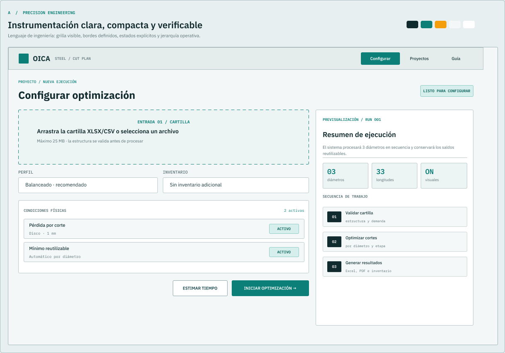
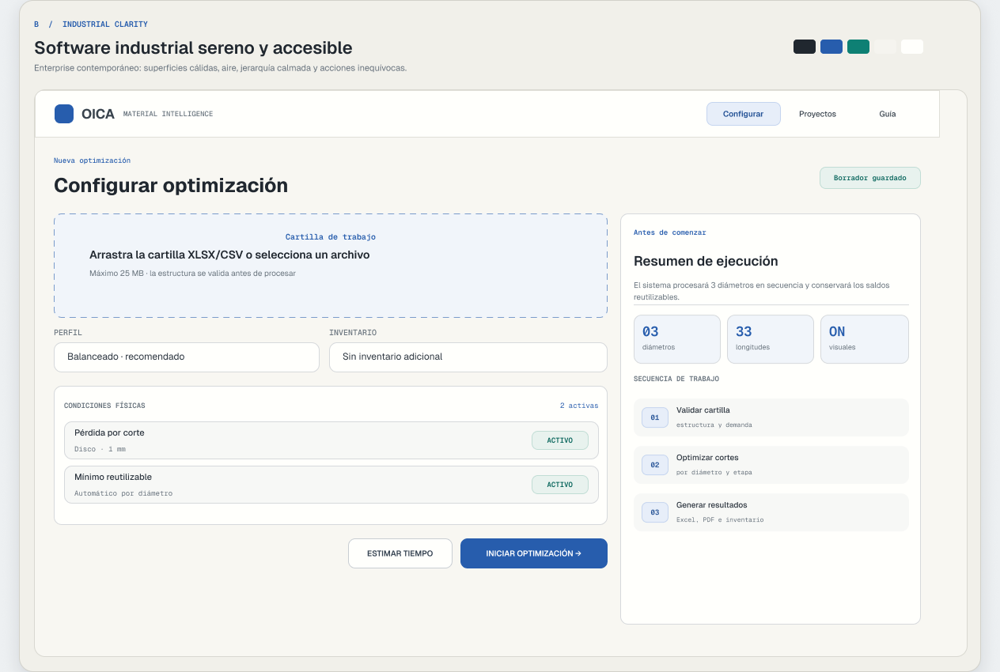

# Direcciones visuales

> **Dirección aprobada el 2026-09-29:** B — Industrial Clarity, con numerales
> monoespaciados y precisión geométrica de A. Las alternativas se conservan como
> registro de exploración, no como temas adicionales del producto.

Comparación completa: [directions-comparison.png](./directions-comparison.png)

Archivo editable: https://www.figma.com/design/pQYp8TECtmWQLDcHISqfZP

La misma pantalla, **Configurar optimización**, se usó para las tres direcciones.

## Opción A — Precision Engineering

- Personalidad: instrumento de ingeniería preciso, verificable y directo.
- Color: verde petróleo, grafito, neutros fríos y ámbar de señal.
- Tipografía: IBM Plex Sans + IBM Plex Mono.
- Superficies: planas, frías y claramente delimitadas.
- Bordes/radius: bordes visibles; radios de 2–4 px.
- Densidad: media-alta.
- Iconografía: Lucide lineal, técnica, 16–20 px.
- Navegación: compacta, con contexto operacional.
- Cards/tablas/inputs: apariencia de panel e instrumentación; métricas monoespaciadas.
- Visualización: grillas, escalas, etiquetas y trazos de alta precisión.
- Interacción: estados rápidos, explícitos y poco ornamentales.

Impacto técnico: escala simple y muy mantenible; exige disciplina en densidad y puede sentirse austera para usuarios ocasionales.

## Opción B — Industrial Clarity

- Personalidad: SaaS industrial profesional, confiable y sereno.
- Color: grafito, azul cobalto para acción, teal para éxito/eficiencia y neutros cálidos.
- Tipografía: Geist + Geist Mono.
- Superficies: capas blancas/cálidas con elevación leve.
- Bordes/radius: bordes suaves; radios de 8–12 px.
- Densidad: media, con aire controlado.
- Iconografía: Lucide consistente, 16–20 px.
- Navegación: clara y discreta; prioriza tareas sobre marca.
- Cards/tablas/inputs: enterprise, legibles y accesibles; tabla desktop con adaptación móvil por tarjetas.
- Visualización: datos protagonistas con color reservado a significado.
- Interacción: transiciones breves, foco visible y feedback calmado.

Impacto técnico: es la dirección más equilibrada para landing, formularios densos, resultados y documentación. Tiene menor riesgo de fatiga visual y facilita accesibilidad.

## Opción C — CAD Control Room

La vista individual está en Figma; también aparece en la [comparación completa](./directions-comparison.png).

- Personalidad: consola técnica/CAD, operativa y de alta densidad.
- Color: navy/graphite oscuro con verde y cyan luminosos.
- Tipografía: Inter + Roboto Mono.
- Superficies: paneles oscuros jerarquizados.
- Bordes/radius: bordes azulados; radios de 2–4 px.
- Densidad: alta.
- Iconografía: Lucide monocroma con acentos de estado.
- Navegación: compacta, estilo control room.
- Cards/tablas/inputs: paneles densos, métricas y estados persistentes.
- Visualización: excelente para patrones de corte, comparación y monitorización.
- Interacción: señales fuertes, estados vivos y menor ornamentación.

Impacto técnico: potente para trabajo prolongado y visualización, pero implica resolver tema oscuro de extremo a extremo y tiene mayor riesgo de contraste/fatiga en contenido largo y contacto.

## Recomendación

**B — Industrial Clarity** como lenguaje base, incorporando dos rasgos de A: numerales monoespaciados en métricas y geometría más precisa en tablas/diagramas.

Motivo: OICA debe servir a una herramienta técnica real, pero también a una tesis, usuarios nuevos, formularios extensos y reportes. B ofrece la mejor relación entre autoridad industrial, accesibilidad, flexibilidad responsive y costo de mantenimiento. A es una alternativa fuerte si se busca una identidad más técnica; C debería elegirse solo si el producto se quiere posicionar explícitamente como consola oscura de operación.

La recomendación fue aceptada explícitamente por el usuario el 2026-09-29.
