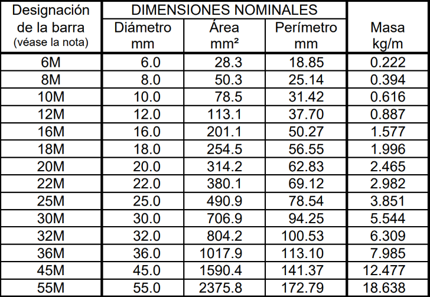
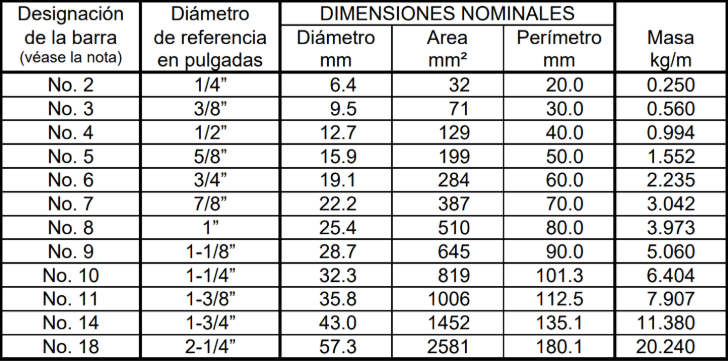

## Capítulo 3

### 3. Metodología

Para llevar a cabo este proyecto de grado, se ha adoptado una metodología estructurada que asegura un enfoque sistemático en cada una de las fases de desarrollo. Esta metodología se basa en un proceso iterativo que permite ajustar y optimizar tanto el diseño como la implementación de la solución a medida que se avanza en el proyecto. Cada una de las etapas ha sido diseñada para abordar un aspecto fundamental del desarrollo de la aplicación web, desde la recopilación de información inicial hasta las pruebas finales que validan su correcto funcionamiento.

A lo largo de este proyecto de grado, se ha delineado el proceso de desarrollo en cinco etapas, las cuales se detallan a continuación:

1.  Etapa 1: Recolección de información primaria, secundaria y definición de los parámetros de diseño de la aplicación
    - Normativa (NSR-10)
    - Tabla de barras de acero dadas por la norma
    - Medidas comerciales de barras de acero en Colombia

2.  Etapa 2: Análisis y definición de la arquitectura de la aplicación web

3.  Etapa 3: Asignación de parámetros y desarrollo de la aplicación

4.  Etapa 4: Implementación de la arquitectura definida y despliegue de la aplicación

5.  Etapa 5: Desarrollo de pruebas unitarias de los diferentes componentes de la app web

#### 3.1 Recolección de información primaria, secundaria y definición de los parámetros de diseño de la aplicación

NSR 10: La Norma Sismo Resistente 2010 o “NSR 10”, es un conjunto de normativas técnicas y reglamentos emitidos en el año 2010 en Colombia que establecen los requisitos mínimos para el diseño, construcción y evaluación de la resistencia sísmica de edificaciones en el país. Esta norma es fundamental en el ámbito de la ingeniería civil y la arquitectura en Colombia, ya que asegura que las estructuras puedan resistir los efectos de un sismo, protegiendo la vida de las personas y reduciendo los daños materiales.

La NSR-10 (Norma Sismo Resistente 2010) es aplicable en la distribución de barras de acero en la construcción de estructuras por varias razones:

1. Requisitos de diseño estructural: La NSR-10 establece criterios y parámetros para el diseño estructural de edificaciones, incluyendo la distribución de barras de acero en elementos como columnas, vigas y losas. Estos requisitos aseguran que la distribución de las barras sea adecuada para soportar las cargas verticales y horizontales, incluidas las generadas por eventos sísmicos.

2. Consideraciones sísmicas: Dado que la NSR-10 tiene en cuenta la resistencia sísmica de las estructuras, su aplicación en la distribución de barras de acero implica considerar cómo estas contribuyen a mejorar la capacidad de la estructura para resistir fuerzas sísmicas. Esto puede incluir la colocación estratégica de barras de refuerzo en zonas de alta demanda de resistencia sísmica, como las zonas de nodos y conexiones estructurales.

3. Dimensionamiento y espaciamiento: La NSR-10 proporciona pautas para el dimensionamiento y espaciamiento mínimo de las barras de acero en función de la carga que deben soportar y las propiedades del material. Esto asegura que la distribución de las barras sea suficiente para cumplir con los requisitos de resistencia y seguridad estructural.

4. Compatibilidad con otros elementos estructurales: La aplicación de la NSR-10 en la distribución de barras de acero también implica considerar la compatibilidad con otros elementos estructurales, como el concreto. Esto puede incluir asegurarse de que las barras estén debidamente ancladas y espaciadas para garantizar una adecuada transferencia de carga entre el acero y el concreto.

En resumen, la NSR-10 es aplicable en la distribución de barras de acero al proporcionar criterios y pautas para el diseño estructural, considerar la resistencia sísmica, establecer dimensiones y espaciamiento adecuados, y garantizar la compatibilidad con otros elementos estructurales. Su aplicación contribuye a la seguridad y estabilidad de las estructuras durante su vida útil.

- Tabla 3: Diámetros nominales de las barras de refuerzo por la NSR-10

- Tabla 4: Dimensiones nominales de las barras de refuerzo por la NSR-10.

  (Diámetros basados en octavos de pulgada)

Las longitudes comerciales de barras de acero en Colombia son reguladas por el Instituto Colombiano de Normas Técnicas y Certificación (ICONTEC) y el Ministerio de Comercio, Industria y Turismo.

1. ICONTEC: Es el organismo nacional encargado de establecer y promover las normas técnicas en Colombia. ICONTEC desarrolla normativas relacionadas con la calidad y especificaciones de los materiales de construcción, incluidas las barras de refuerzo. A través de la elaboración de normas técnicas como la NTC 2289, se establecen requisitos para las dimensiones, características y calidad de las barras de refuerzo utilizadas en la construcción.

2. Ministerio de Comercio, Industria y Turismo: Este ministerio, a través de sus diferentes subdivisiones y organismos, regula el comercio y la industria en Colombia. Puede establecer regulaciones específicas relacionadas con la importación, exportación, comercialización y calidad de productos como las barras de refuerzo. Estas regulaciones pueden incluir requisitos sobre las longitudes comerciales permitidas y las normas que deben cumplir las barras de refuerzo vendidas en el mercado colombiano.

Además de estas entidades, otros organismos gubernamentales como el Ministerio de Vivienda, Ciudad y Territorio y el Ministerio de Transporte pueden tener influencia en la regulación de las barras de refuerzo en el contexto de la construcción de infraestructuras y edificaciones, estableciendo normativas específicas para garantizar la seguridad y la calidad de las estructuras.

En resumen, las longitudes comerciales de las barras de refuerzo en construcción para Colombia son reguladas por entidades como ICONTEC y el Ministerio de Comercio, Industria y Turismo, que establecen normativas técnicas y requisitos de calidad para estos materiales.

#### 3.2 Análisis y definición de la arquitectura de la aplicación web

#### 3.3 Asignación de parámetros y desarrollo de la aplicación web

En esta etapa, se procede a materializar el diseño conceptual y los parámetros técnicos definidos en las etapas anteriores, transformándolos en componentes funcionales de la aplicación web. La asignación de parámetros es fundamental para asegurar que la aplicación se adapte a las condiciones del mercado colombiano, incluyendo las medidas comerciales de las barras de acero.

El desarrollo de la aplicación implica la construcción tanto del backend como del frontend, asegurando que ambos componentes se integren de manera eficaz para ofrecer una solución robusta y eficiente. Además, se considerarán aspectos críticos como la seguridad de la aplicación y la preparación para pruebas iniciales. A continuación, se detallan los pasos clave en esta fase:

##### 3.3.1 Definición de Parámetros Técnicos.

Se utiliza la tabla de barras de acero proporcionada por la NSR-10 para establecer los parámetros técnicos que guiarán el comportamiento de la aplicación. Esto incluye el diámetro y la masa por tipo de barra.

Se implementan las medidas comerciales de barras de acero específicas de Colombia en la base de datos de la aplicación.

##### 3.3.2 Desarrollo del Backend.

###### 3.3.2.1 Optimizador Inteligente de Cortes de Acero (OICA)

- Descripción del Proyecto: El Optimizador Inteligente de Cortes de Acero (OICA) es una aplicación desarrollada para resolver el problema de optimización de cortes en barras de acero, utilizando algoritmos genéticos. Su objetivo principal es maximizar el aprovechamiento del material, minimizando los desperdicios y cumpliendo con los requerimientos específicos de cada pedido.

- Entrada de Datos
  - Cartilla de acero: Archivo XLSX con los pedidos, especificando el diámetro, longitud y cantidad de cada pieza requerida.

  - Barras estándar: Archivo JSON con las longitudes comerciales disponibles para cada diámetro de barra.

- Proceso de Optimización
  - Adaptación de datos: Conversión de los datos de entrada a un formato interno adecuado para el algoritmo genético.

  - Configuración flexible: Permite seleccionar perfiles de optimización (rápido, balanceado, intensivo) o personalizar los parámetros del algoritmo.

  - Ejecución del algoritmo genético:
    - Inicialización de la población de soluciones.
    - Evaluación de la eficiencia de cada solución (fitness).
    - Aplicación de operadores genéticos: selección, cruce y mutación.
    - Evolución de la población hasta cumplir los criterios de parada (número de generaciones, convergencia, tiempo límite, etc.).

  - Generación de patrones de corte: Identificación de las combinaciones óptimas de cortes para cada barra estándar.

  - Gestión de desperdicios: Clasificación de los desperdicios generados en utilizables y no utilizables, y su posible reutilización en etapas posteriores.

- Salida de Resultados
  - Plan de corte ejecutable: Documento en formato Markdown con el detalle de los patrones de corte, lista de compras de barras, desperdicios generados y control de calidad.

  - Archivo CSV de resultados: Resumen estructurado de los cortes y patrones generados para su análisis o integración con otros sistemas.

##### 3.3.3 Desarrollo del Frontend.

1. Lenguaje y Frameworks Utilizados
   - Lenguaje principal:

     El frontend está desarrollado en TypeScript, un superset de JavaScript que añade tipado estático, lo que mejora la mantenibilidad y robustez del código.

   - Framework principal:

     Se utiliza React (con sintaxis de componentes funcionales y hooks), una de las librerías más populares para la construcción de interfaces de usuario dinámicas y reactivas.

   - Herramientas y librerías adicionales:
     - Next.js (implícito por el uso de 'use client'): Framework para React que facilita el rendering del lado del cliente y servidor, así como la organización de rutas y optimización.

     - react-dropzone: Para la gestión de la carga de archivos mediante drag & drop.

     - lucide-react: Para iconografía moderna y personalizable.

     - Tailwind CSS: (deducido por las clases de utilidad en los componentes) para estilos rápidos y responsivos.

     - Componentes personalizados: Como Button y servicios propios para la gestión de URLs prefirmadas.

2. Funcionalidad Implementada
   - Carga y Envío de Archivos
   - Carga de archivos XLSX:
     - El usuario puede seleccionar o arrastrar un archivo con extensión .xlsx.
     - Se limita a un solo archivo por carga.
     - Se muestra el nombre del archivo seleccionado.

   - Validación de datos:
     - El sistema exige que el usuario ingrese un número de documento (solo numérico) para identificar el archivo.
     - No permite enviar si falta el archivo o el número de documento.

   - Renombrado y envío seguro:
     - El archivo se renombra automáticamente usando el número de documento proporcionado, siguiendo el formato: [documentNumber]-BASE.xlsx.

     - Se solicita una URL prefirmada a un backend (probablemente AWS Lambda) para subir el archivo de forma segura a un bucket S3.

     - El archivo se envía usando un formulario multipart/form-data a la URL prefirmada, cumpliendo con los requisitos de seguridad y escalabilidad de AWS S3.

   - Feedback al usuario:
     - Se muestra un botón de carga con estado de loading mientras se realiza el envío.
     - Se limpian los campos tras un envío exitoso.
     - Se muestran mensajes de error en consola en caso de fallos.

3. Interfaz de Usuario
   - Diseño moderno y responsivo:
     - Uso de Tailwind CSS para una interfaz limpia, moderna y adaptable a distintos tamaños de pantalla.
     - Elementos visuales claros: botones grandes, campos de entrada bien definidos, mensajes de ayuda y feedback visual en los estados de drag & drop.
   - Accesibilidad y usabilidad:
     - El campo de número de documento solo acepta números.
     - Botones y campos con suficiente contraste y tamaño para facilitar su uso.

4. Estructura del Código
   - Componentización:
     - El componente principal FileUpload encapsula toda la lógica y presentación de la carga de archivos.
     - Uso de hooks (useState, useCallback) para el manejo de estado y eventos.

   - Separación de responsabilidades:
     - La lógica de obtención de la URL prefirmada está delegada a un servicio (PresignedURLManagerService), facilitando la reutilización y pruebas.

5. Buenas Prácticas Aplicadas
   - Tipado estático con TypeScript para evitar errores comunes y mejorar la autocompletación.
   - Validaciones en el frontend para evitar errores de usuario.
   - Manejo de estados de carga para mejorar la experiencia de usuario.
   - Uso de servicios externos (presigned URLs) para mantener la seguridad y escalabilidad en la gestión de archivos.

6. Posibles Mejoras Futuras
   - Mostrar mensajes de éxito/error al usuario en la interfaz (no solo en consola).
   - Permitir la visualización previa del archivo cargado.
   - Internacionalización para soportar varios idiomas.
   - Tests unitarios y de integración para asegurar la robustez del componente.

Resumen

El frontend implementa una solución moderna, segura y eficiente para la carga de archivos Excel, integrando buenas prácticas de desarrollo web y una experiencia de usuario amigable. Está preparado para escalar y adaptarse a nuevas funcionalidades según las necesidades del proyecto.

La interfaz tendrá un widget para subir el archivo excel...

1. Configuración de la Seguridad.
2. Integración de Herramientas de Monitoreo.
3. Pruebas Iniciales.

> NOTA: CAMBIAR LA SECCIÓN DE FRONTEND
