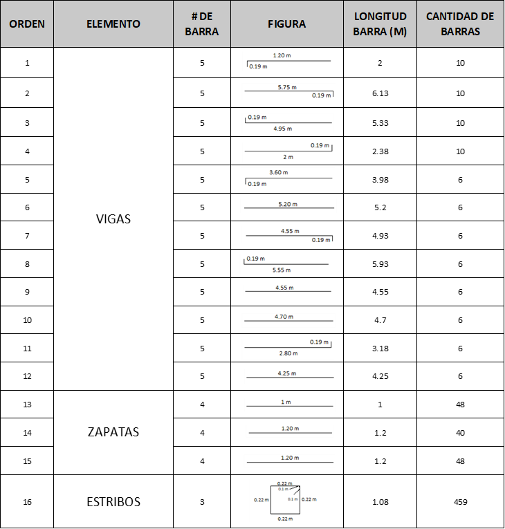

## Capitulo 4 
## 4. Análisis de Resultados

Para el análisis de resultados se tomaron como referencia dos cartillas de acero. La primera fue elaborada en semestres anteriores por estudiantes de la asignatura “Construcción de edificaciones”, dentro de un proyecto que buscaba determinar la cantidad más eficiente de barras de acero de 6, 9 y 12 metros para una vivienda unifamiliar de dos pisos. La segunda corresponde a un proyecto real de edificaciones. Ambas cartillas se incluyen como anexos al final de este documento. 

Con el fin de evaluar la eficiencia, se realizó una comparativa directa entre los resultados de la Cartilla N°1 y los obtenidos mediante el aplicativo desarrollado. Los resultados finales de la Cartilla N°2 solo se presentarán como información de referencia, sin incluir una comparación detallada. Es importante considerar que la Cartilla N°1 (proyecto académico) se realizó de forma manual, por lo que puede estar sujeta a errores humanos. Por otro lado, la Cartilla N°2 (proyecto real) fue seleccionada cuidadosamente para garantizar la mayor eficiencia en la ejecución del proyecto. 

### 4.1 Comparación de resultados para la “Cartilla N°1” 

- Método Manual
 
    En primer lugar, el análisis del despiece del proyecto revela que el número de órdenes generadas es poco significativo, lo que indica que se trata de un proyecto de pequeña escala. A continuación, se detallan las órdenes de despiece del proyecto: 

    

