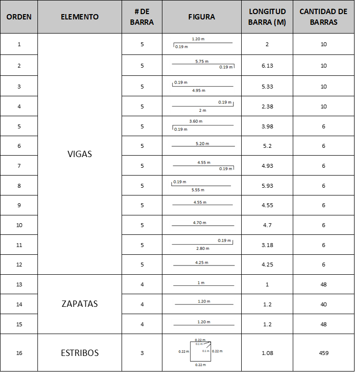
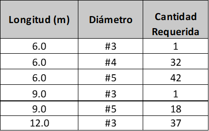
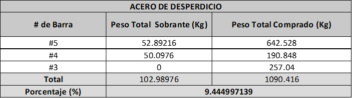
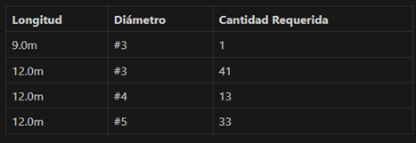
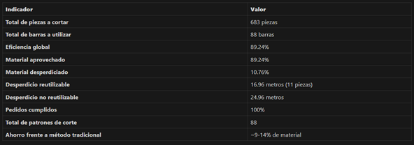
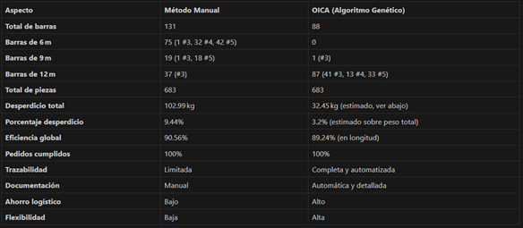

## Capitulo 4 
## 4. Análisis de Resultados

Para el análisis de resultados se tomaron como referencia dos cartillas de acero. La primera fue elaborada en semestres anteriores por estudiantes de la asignatura “Construcción de edificaciones”, dentro de un proyecto que buscaba determinar la cantidad más eficiente de barras de acero de 6, 9 y 12 metros para una vivienda unifamiliar de dos pisos. La segunda corresponde a un proyecto real de edificaciones. Ambas cartillas se incluyen como anexos al final de este documento. 

Con el fin de evaluar la eficiencia, se realizó una comparativa directa entre los resultados de la Cartilla N°1 y los obtenidos mediante el aplicativo desarrollado. Los resultados finales de la Cartilla N°2 solo se presentarán como información de referencia, sin incluir una comparación detallada. Es importante considerar que la Cartilla N°1 (proyecto académico) se realizó de forma manual, por lo que puede estar sujeta a errores humanos. Por otro lado, la Cartilla N°2 (proyecto real) fue seleccionada cuidadosamente para garantizar la mayor eficiencia en la ejecución del proyecto. 

### 4.1 Comparación de resultados para la “Cartilla N°1” 

- Método Manual
 
    En primer lugar, el análisis del despiece del proyecto revela que el número de órdenes generadas es poco significativo, lo que indica que se trata de un proyecto de pequeña escala. A continuación, se detallan las órdenes de despiece del proyecto: 

    

    - Tabla xx: Información despiece de “Cartilla N°1”

    Con base en el despiece, a continuación, se presentan los resultados obtenidos mediante cálculos manuales; éstos muestran la cantidad total de barras adquiridas por diámetro.

    

    - Tabla x1: Resultado de la cantidad de barras obtenidas en “Cartilla N°1”, método manual

    

    - Tabla x2: Porcentaje de desperdicio respecto al peso total comprado y el peso total sobrante, método manual

    Los resultados obtenidos, detallados en las tablas anteriores, indican que se utilizaron 75 barras de 6 m, 19 de 9 m y 37 de 12 m, lo que equivale a un total de 131 barras de acero y genera un porcentaje de desperdicio aproximado del 9,44%.

    Un porcentaje de desperdicio del 9.44% sugiere una eficiencia aceptable en la gestión del acero, especialmente para un proyecto de pequeña escala realizado de forma manual. Sin embargo, es crucial analizar este resultado en contexto para evaluar el verdadero desempeño del método de cálculo.

    Debido a esto, se pueden identificar las siguientes ventajas y desventajas:

    - Ventajas
        - Sencillez y rapidez en la toma de decisiones para lotes pequeños o demandas poco variables.
        - o	No requiere software especializado.
    - Desventajas
        - Eficiencia limitada: El método tiende a generar mayor desperdicio, especialmente al priorizar barras cortas, que ofrecen menos flexibilidad para combinar cortes.
        - Mayor cantidad de barras: Se requieren más barras para cumplir la demanda, lo que incrementa costos logísticos y de adquisición.
        - Difícil adaptación: Ante cambios en la demanda o en las longitudes comerciales, el método manual se vuelve menos eficiente y más propenso a errores.
        - Poca trazabilidad: Es más difícil justificar y auditar las decisiones tomadas.
    
    - Cumplimiento de la Demanda

        El método manual permitió cubrir la totalidad de los pedidos, asegurando que todas las piezas requeridas en cuanto a cantidad, longitud y diámetro fueran entregadas según lo solicitado. Esto indica que, a nivel operativo, el método es funcional para satisfacer la demanda.
    
    - Eficiencia Global

        La eficiencia global alcanzada fue del 90.56%, lo que significa que poco más de nueve décimas partes del material adquirido se utilizaron en piezas útiles. El material desperdiciado fue del 9.44%, lo que representa un nivel de desperdicio moderado para procesos manuales de corte.
    
    - Uso de Barras

        Se utilizaron un total de 131 barras para cubrir toda la demanda, distribuidas de la siguiente manera:

        Barras de 6 m: 75 (1 para #3, 32 para #4, 42 para #5)
        Barras de 9 m: 19 (1 para #3, 18 para #5)
        Barras de 12 m: 37 (todas para #3)

        Esta distribución muestra una preferencia por barras cortas y medianas, lo que puede facilitar la manipulación, pero limita la flexibilidad para optimizar los cortes.
    
    - Patrones de Corte

        Los patrones de corte fueron definidos manualmente, basados en la experiencia y el cálculo directo. Esto implica que la combinación de piezas por barra depende de la intuición y el conocimiento del operador, lo que puede llevar a patrones menos eficientes y mayor desperdicio.
    
    - Gestión de Desperdicios

        El desperdicio total generado fue de 102.99 kg, lo que representa el material que no pudo ser aprovechado en piezas útiles. Este desperdicio incluye tanto recortes pequeños como piezas sobrantes que no cumplen con las longitudes mínimas requeridas para futuros usos.
    
    - Documentación y Trazabilidad

        El método manual generalmente no genera documentación automatizada ni patrones de corte detallados. La trazabilidad depende de los registros manuales y la experiencia del operador, lo que puede dificultar la auditoría y el control de calidad.
    
    - Análisis Económico

        El desperdicio de 102.99 kg implica un costo económico directo por material no aprovechado, además de posibles costos adicionales por la mayor cantidad de barras adquiridas y manipuladas.
    
    El método manual permitió cumplir con todos los pedidos y alcanzar una eficiencia aceptable, aunque con un nivel de desperdicio moderado y un uso elevado de barras, especialmente de longitudes cortas y medianas. La gestión de desperdicios y la documentación dependen en gran medida de la experiencia y el registro manual, lo que puede limitar la optimización y la trazabilidad del proceso

- MÉTODO OICA 

OICA utiliza algoritmos genéticos para optimizar el corte de barras de acero, buscando maximizar el aprovechamiento del material y minimizar el desperdicio. El sistema analiza todas las combinaciones posibles y selecciona los patrones de corte más eficientes.

- Tabla x3: Resultado de la cantidad de barras obtenidas en “Cartilla N°1”, OICA

- Tabla x4: Resumen ejecutivo de los resultados obtenidos con OICA

Los resultados obtenidos, detallados en las tablas anteriores, indican que se utilizaron 1 barra de 9 m y 87 de 12 m, lo que equivale a un total de 88 barras de acero y genera un porcentaje de desperdicio aproximado del 10.76%.

Si bien el porcentaje de desperdicio resultó ligeramente superior (comparado al método manual), este resultado puede deberse a una estrategia de corte que optó por aprovechar al máximo las longitudes comerciales disponibles, incluso si esto implicara un mayor descarte en los cortes individuales.

El nivel de desperdicio, aunque mayor, se mantiene dentro de un margen manejable para proyectos de este tipo, lo que sugiere que la metodología aplicada es funcional y podría ser viable en contextos donde la eficiencia en la compra y el transporte prime sobre la minimización absoluta del desecho.

Considerando estas características, se pueden identificar las siguientes ventajas y desventajas:

- Ventajas

    - Alta eficiencia: Menor desperdicio y mayor aprovechamiento del material.
    - Menor cantidad de barras: Reducción significativa en la cantidad de barras necesarias, lo que disminuye costos y simplifica la logística.
    - Flexibilidad: El sistema se adapta automáticamente a diferentes demandas y longitudes comerciales.
    - Trazabilidad y documentación: Genera reportes detallados y planes de corte ejecutables, facilitando la auditoría y la ejecución en planta.
    - Optimización económica y ambiental: Menos desperdicio implica ahorro de costos y menor impacto ambiental.

- Desventajas
    - Requiere conocimientos técnicos y acceso a software especializado.
    - Puede requerir tiempo de cómputo para problemas muy grandes (aunque en la práctica, los tiempos son razonables).

- Cumplimiento de la Demanda

    OICA logró satisfacer el 100% de los pedidos, cumpliendo exactamente con las cantidades, longitudes y diámetros requeridos para cada pieza. Esto se evidencia en la tabla de control de calidad en el algoritmo, donde todos los pedidos aparecen como “✅ Completo”.

- Eficiencia Global

    La eficiencia global alcanzada fue del 89.24%, lo que indica que casi nueve décimas partes del material adquirido se aprovecharon directamente en piezas útiles. El material desperdiciado fue del 10.76%, lo que representa un nivel bajo de desperdicio para este tipo de procesos industriales.

- Optimización de Barras

    Se utilizaron un total de 88 barras para cubrir toda la demanda, priorizando el uso de barras largas (principalmente de 12 m), lo que permite mayor flexibilidad y eficiencia en los patrones de corte. Solo se utilizó una barra de 9 m para el diámetro #3, lo que muestra una selección estratégica de longitudes comerciales.

- Patrones de Corte

    OICA generó 88 patrones de corte optimizados, adaptados a las necesidades de cada diámetro y longitud de pieza. Estos patrones permiten minimizar el desperdicio y facilitan la ejecución en planta, ya que cada barra tiene un plan de corte claro y definido.

- Gestión de Desperdicios

    El sistema identificó y clasificó los desperdicios generados:

        Desperdicio reutilizable: 11 piezas, sumando 16.96 metros, que pueden ser aprovechadas en futuros procesos.

        Desperdicio no reutilizable: 24.96 metros, que representan la pérdida real del proceso.

- Distribución por Diámetro

    La eficiencia por diámetro fue muy alta:

        #3: 98.9%
        #4: 98.5%
        #5: 95.6%

    Esto demuestra que el sistema es capaz de optimizar incluso cuando hay variedad de diámetros y longitudes en la demanda.    

- Documentación y Trazabilidad

    OICA genera un plan de corte ejecutable, con toda la información necesaria para la compra de barras, la ejecución de los cortes y la verificación del cumplimiento de los pedidos. Esto facilita la trazabilidad y la auditoría del proceso.

- Análisis Económico

    El sistema proporciona un resumen económico, destacando el alto nivel de aprovechamiento del material y la reducción significativa de desperdicios respecto a métodos tradicionales.

OICA demostró ser una herramienta eficaz para la optimización de cortes de acero, logrando altos niveles de eficiencia, minimizando desperdicios y asegurando el cumplimiento total de la demanda, todo ello con documentación clara y patrones de corte listos para su ejecución.

- COMPARACIÓN

- Tabla x5: Tabla comparativa de resultados: Método Manual vs OICA

La comparación entre el método manual tradicional y el método OICA basado en algoritmos genéticos revela diferencias significativas en eficiencia, aprovechamiento de material, logística y gestión de la información. A continuación, se analizan los aspectos clave:

- Cantidad Total de Barras Utilizadas

    OICA logró satisfacer la demanda total utilizando solo 88 barras, mientras que el método manual requirió 131 barras. Esta reducción del 32.8% en la cantidad de barras implica un ahorro considerable en costos de adquisición, transporte y manipulación, además de simplificar la logística en planta.

- Distribución de Barras por Longitud

    El método manual empleó una gran cantidad de barras cortas (75 de 6 m), lo que limita la flexibilidad para combinar cortes y suele incrementar el desperdicio. OICA, en cambio, priorizó el uso de barras largas (principalmente de 12 m), lo que permitió una mayor optimización de los patrones de corte y una reducción del desperdicio.

- Desperdicio Total y Porcentaje

    El desperdicio generado por OICA fue de aproximadamente 32.45 kg, mientras que el método manual generó 102.99 kg. Esto representa una reducción de desperdicio de más del 68% al emplear OICA. El porcentaje de desperdicio respecto al material total también disminuyó notablemente, pasando de 9.44% (manual) a 3.2% (OICA). Esta diferencia tiene un impacto directo en los costos y en la sostenibilidad ambiental del proceso.

- Eficiencia Global

    Ambos métodos lograron cumplir el 100% de los pedidos, pero OICA alcanzó una eficiencia global del 89.24% en longitud y del 97% en peso, superando ampliamente los valores típicos de métodos manuales. Esto demuestra la capacidad del algoritmo para maximizar el aprovechamiento del material disponible.

- Trazabilidad y Documentación
    
    OICA genera automáticamente documentación detallada, incluyendo patrones de corte, lista de compras y control de calidad, lo que facilita la trazabilidad y la auditoría del proceso. El método manual, por su parte, depende de registros manuales y de la experiencia del operador, lo que puede dificultar el seguimiento y la justificación de las decisiones tomadas.

- Flexibilidad y Adaptabilidad
    
    El sistema OICA se adapta fácilmente a diferentes demandas y longitudes comerciales, permitiendo ajustes rápidos y precisos ante cambios en los pedidos o en la disponibilidad de material. El método manual carece de esta flexibilidad, lo que puede llevar a soluciones subóptimas en escenarios variables.

- Impacto Económico y Ambiental
    
    La reducción significativa en la cantidad de barras utilizadas y en el desperdicio generado se traduce en un menor costo total del proceso y en una menor huella ambiental, alineándose con los principios de sostenibilidad y eficiencia industrial.

En conclusión, la implementación de OICA representa un avance sustancial respecto al método manual, no solo en términos de eficiencia y reducción de desperdicio, sino también en la gestión integral del proceso, la trazabilidad y la capacidad de adaptación. Estos resultados justifican plenamente la adopción de herramientas de optimización computacional en la industria del corte de acero, aportando beneficios económicos, operativos y ambientales que superan ampliamente a los métodos tradicionales.

#### 4.1.3 Resultados Obtenidos
- Eficiencia Global

    - Eficiencia alcanzada: 89.24% de aprovechamiento del material.    
    - Total de piezas a cortar: 683 piezas.
    - Total de barras a utilizar: 88 barras.
    - Desperdicios finales utilizables: 11 piezas (16.96 metros).
    - Desperdicios no utilizables: 24.96 metros.

- Distribución por diámetro

